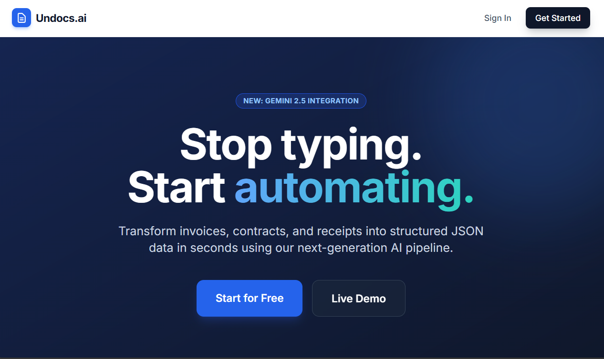
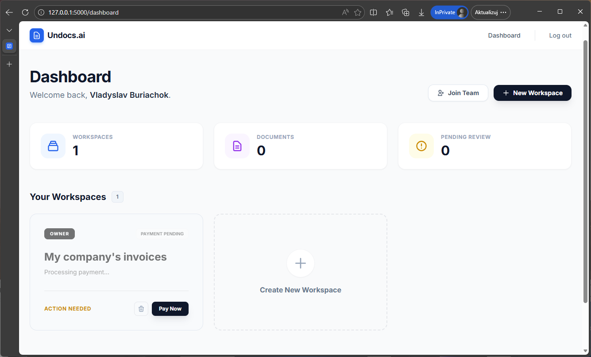
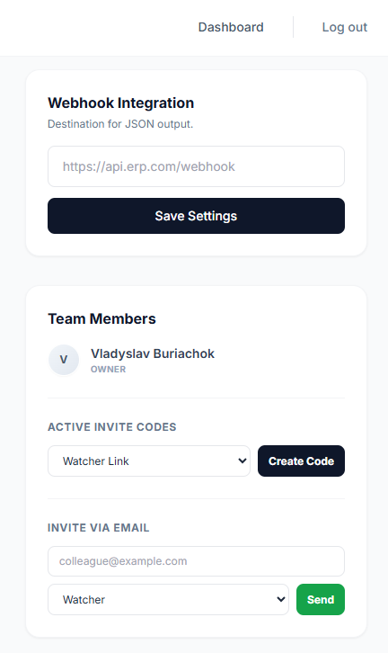
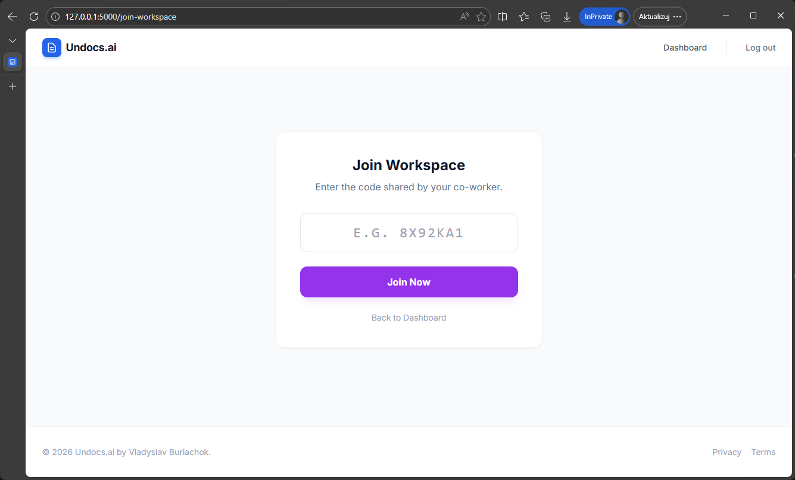
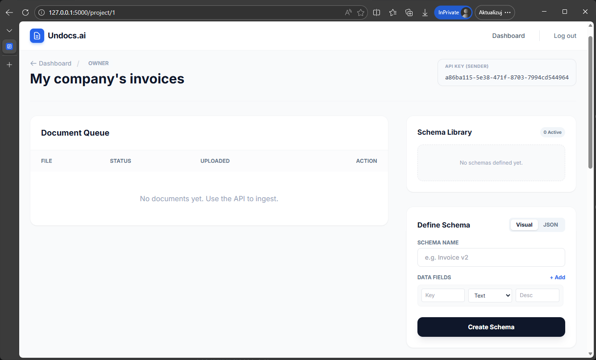
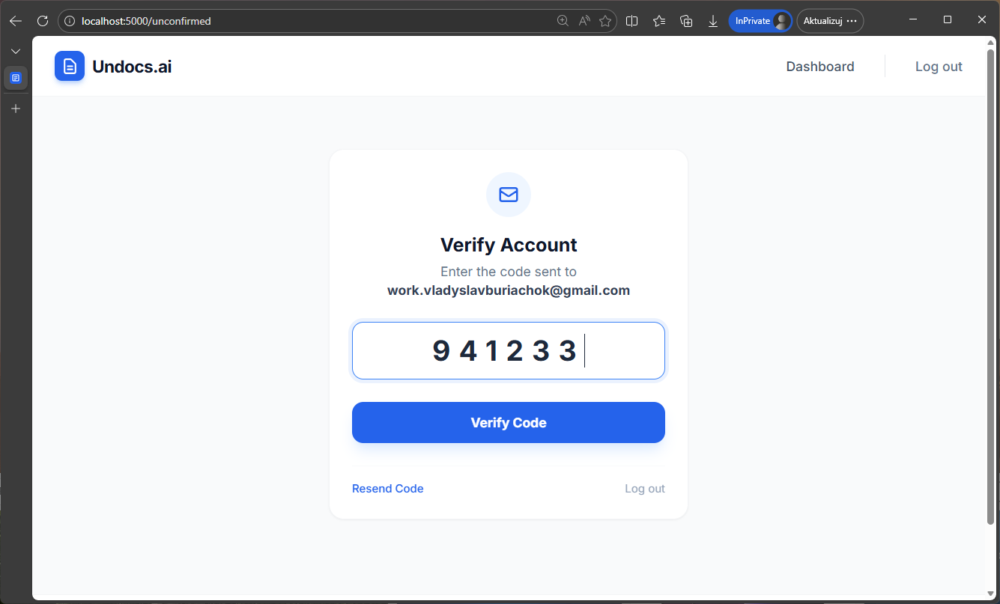
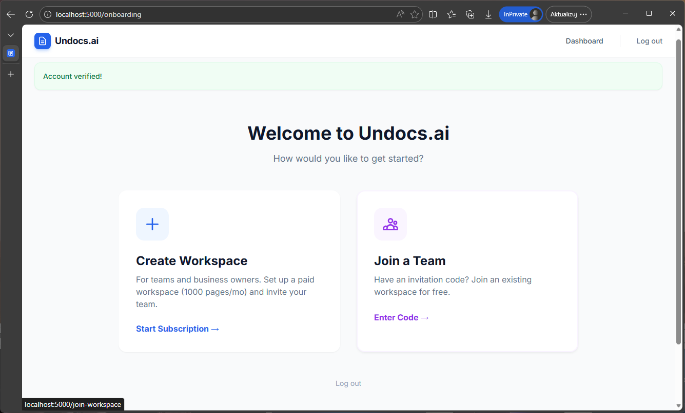

# Undocs.ai - Intelligent Document Processing Platform

<p align="center">
  
  
  
  
  
  
  
</p>

<p align="center">
  
</p>

**Undocs.ai** is a SaaS platform for automating data extraction from documents (PDFs, Images) using Multimodal AI. It features a complete "Human-in-the-loop" workflow, enabling users to define complex JSON schemas, ingest documents via API, verify data in a split-screen UI, and sync results via Webhooks.

## 🎬 See it in action (30s Demo)

<p align="center">
  <video src="./assets/undocs-quick-demo.mp4" autoplay loop muted playsinline width="100%"></video>
</p>


## 🚀 Key Features

### 🧠 AI & Data Extraction
*   **Gemini 2.5 Flash Integration:** Uses Google's latest multimodal model for high-accuracy vision extraction.
*   **JSON Schema Engine:** Supports complex nested schemas (Arrays, Objects) and strictly enforces data types (Date, Number, Boolean).
*   **Schema Sanitizer:** Automatically injects descriptions into schemas to optimize AI prompting.

<table align="center">
  <tr>
    <td align="center">
      
      <br>
      <em>Every Document Workflow in a Single Dashboard</em>
    </td>
  </tr>
</table>

### 🏢 Multi-Tenant SaaS Architecture
*   **Workspace Model:** Users can create multiple paid workspaces or join existing ones via invite codes.
*   **Role-Based Access Control (RBAC):**
    *   👑 **Owner:** Full control, billing management, deletion.
    *   🛡️ **Admin:** Manage schemas and users.
    *   ✍️ **Verifier:** Correct data and process queue.
    *   👀 **Watcher:** View-only access.
*   **Stripe Subscriptions:** Async payment processing using Webhooks (Checkout Sessions & lifecycle management).

<table align="center">
  <tr>
    <td align="center">
      
      <br>
      <em>Invite Team Members & Set Roles</em>
    </td>
    <td align="center">
      
      <br>
      <em>Join Workspaces via Invite Codes</em>
    </td>
    <td align="center">
      
      <br>
      <em>See Document Queue & Define Schemas</em>
    </td>
  </tr>
</table>

### 🔒 Security & Auth
*   **Secure Authentication:** Email/Password with Hash (Werkzeug) and session management.
*   **OTP Verification:** Email-based 6-digit Time-based One-Time Password (TOTP) for account activation.
*   **Project Isolation:** Strict database filtering ensures users only access data within their assigned scope.

<table align="center">
  <tr>
    <td align="center">
      
      <br>
      <em>Verify Your E-mail</em>
    </td>
</table>

### 🎨 Modern UI/UX
*   **Responsive Design:** Fully mobile-compatible dashboard and verification tools (Tailwind CSS).
*   **Split-Screen Verifier:** Auto-switching UI that renders Form Inputs for simple data and a Monaco-style JSON Editor for complex nested data.
*   **Visual Schema Builder:** No-code interface for defining data structures.

<table align="center">
  <tr>
    <td align="center">
      
      <br>
      <em>Welcome to Undocs.ai...</em>
    </td>
  </tr>
</table>


## 🛠️ Tech Stack

*   **Backend:** Python, Flask, Flask-SQLAlchemy, Flask-Login.
*   **Database:** SQLite (Dev), scalable to PostgreSQL.
*   **Frontend:** HTML5, Tailwind CSS (CDN), Alpine.js, Jinja2 Templates.
*   **AI Provider:** Google Cloud Vertex AI (Generative Models).
*   **Payments:** Stripe API + CLI for Webhook tunneling.
*   **Email:** SMTP (Gmail/SendGrid support).


## ⚙️ Installation & Local Setup

### 1. Clone & Env
```bash
git clone <maybe i will create a repo>
cd undocs-ai
python -m venv .venv
source .venv/bin/activate  # Windows: .venv\Scripts\activate
pip install -r requirements.txt
```

### 2. Configuration
Create a `.env` file based on `.env.example`:
```ini
SECRET_KEY=dev-secret
SQLALCHEMY_DATABASE_URI=sqlite:///undocs.db

# Google Cloud (Vertex AI)
GOOGLE_CLOUD_PROJECT=your-gcp-project-id
GOOGLE_CLOUD_LOCATION=us-central1
GOOGLE_APPLICATION_CREDENTIALS=service-account.json

# Stripe (Test Mode)
STRIPE_PUBLISHABLE_KEY=pk_test_...
STRIPE_SECRET_KEY=sk_test_...
STRIPE_WEBHOOK_SECRET=whsec_...

# Email (SMTP)
MAIL_SERVER=smtp.gmail.com
MAIL_PORT=587
MAIL_USE_TLS=True
MAIL_USERNAME=your@email.com
MAIL_PASSWORD=your-app-password
```

### 3. Run Application
```bash
python app.py
```
Access the app at `http://127.0.0.1:5000`.

### 4. Process Payments (Local)
To make the "Pending Payment" status update to "Active", run the Stripe CLI:
```bash
stripe login
stripe listen --forward-to localhost:5000/hooks/stripe
```

---

### `requirements.txt`

```text
flask
flask-sqlalchemy
flask-login
flask-mail
werkzeug
google-cloud-aiplatform
stripe
requests
python-dotenv
```

## 📖 API Documentation

The platform exposes an ingestion endpoint for scripts/ERPs to push documents.

### Ingest Document
**POST** `/api/ingest`

**Headers:**
*   `X-API-Key`: `(Get this from Workspace Settings)`

**Body (Multipart/Form-Data):**
*   `file`: The PDF or Image file.
*   `schema_name`: The exact name of the schema to use.

**Example (Python):**
```python
import requests

url = "http://localhost:5000/api/ingest"
headers = {"X-API-Key": "your-uuid-key"}
files = {"file": open("invoice.pdf", "rb")}
data = {"schema_name": "Invoice v1"}

response = requests.post(url, headers=headers, files=files, data=data)
print(response.json())
```

## ⚖️ License

Academic Project - MIT License.