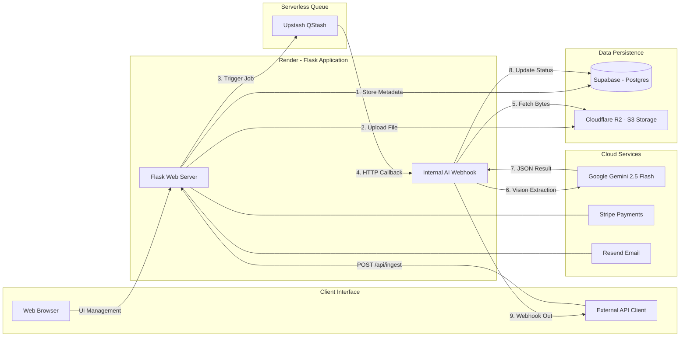

# Undocs.ai - Intelligent Document Processing Platform

<p align="center">
  <!-- Core Stack -->
  
  
  
  <br>
  <!-- Infrastructure -->
  
  
  
  
  <br>
  <!-- Services -->
  
  
  
  <br>
  <!-- Standards -->
  
</p>

<p align="center">
  
</p>

**Undocs.ai** is a production-grade SaaS platform for automating data extraction from documents (PDFs, Images) using Multimodal AI. Optimized for a $0-overhead serverless architecture, it features a complete "Human-in-the-loop" workflow, enabling users to define JSON schemas, ingest via API, and sync results via Webhooks.

## 🚀 Live Demo
**[Launch Undocs.ai](https://undocs-ai.onrender.com/)**  
*Try the Sandbox Tier: 10 free AI extractions, no credit card required.*

## 🎬 See it in action (30s Demo)

<p align="center">
  <video src="https://github.com/user-attachments/assets/1e1ade6a-0751-4e42-a003-f838c023cf8a" autoplay loop muted playsinline width="100%"></video>
</p>

## 🏗️ v2.0 Architecture Highlights
The platform was recently refactored from a v1.0 prototype to a robust, scalable v2.0 architecture:
*   **Serverless Queue (Upstash QStash):** Decoupled background processing. AI jobs are handled via regional EU-central endpoints with automatic retries.
*   **Zero-Egress Storage (Cloudflare R2):** S3-compatible private storage for user documents, preventing unauthorized access via pre-signed URLs.
*   **Usage Metering:** Strict page-level counting (PyMuPDF) and identity-based trial enforcement to prevent abuse.
*   **Encrypted Secrets:** API Keys are SHA-256 hashed for verification and AES-256 encrypted for secure UI "Reveal."
*   **Memory Optimized:** Lazy-loading and single-worker Gunicorn configuration to run reliably on Render's 512MB RAM tier.

## 🚀 Key Features

### 🧠 AI & Data Extraction
*   **Gemini 2.5 Flash Integration:** Uses Google's multimodal model for high-accuracy vision extraction.
*   **JSON Schema Engine:** Supports complex nested schemas (Arrays, Objects) and strictly enforces data types (Date, Number, Boolean).
*   **Schema Sanitizer:** Automatically injects descriptions into schemas to optimize AI prompting.

<table align="center">
  <tr>
    <td align="center">
      
      <br>
      <em>Every Document Workflow in a Single Dashboard</em>
    </td>
  </tr>
</table>

### 🏢 Multi-Tenant SaaS Architecture
*   **Workspace Model:** Users can create multiple paid workspaces or join existing ones via invite codes. Identity-based "Sandbox" trial followed by unlimited Pro workspaces.
*   **Role-Based Access Control (RBAC):**
    *   👑 **Owner:** Full control, billing management, deletion.
    *   🛡️ **Admin:** Manage schemas and users.
    *   ✍️ **Verifier:** Correct data and process queue.
    *   👀 **Watcher:** View-only access.
*   **Stripe Subscriptions:** Async payment processing using Webhooks (Checkout Sessions & lifecycle management).

<table align="center">
  <tr>
    <td align="center">
      
      <br>
      <em>Invite Team Members & Set Roles</em>
    </td>
    <td align="center">
      
      <br>
      <em>Join Workspaces via Invite Codes</em>
    </td>
    <td align="center">
      
      <br>
      <em>See Document Queue & Define Schemas</em>
    </td>
  </tr>
</table>

### 🔒 Security & Auth
*   **Secure Authentication:** Email/Password with Hash (Werkzeug) and session management.
*   **OTP Verification:** Email-based 6-digit Time-based One-Time Password (TOTP) for account activation.
*   **Project Isolation:** Strict database filtering ensures users only access data within their assigned scope.

<table align="center">
  <tr>
    <td align="center">
      
      <br>
      <em>Verify Your E-mail</em>
    </td>
</table>

### 🎨 Modern UI/UX
*   **Responsive Design:** Fully mobile-compatible dashboard and verification tools (Tailwind CSS).
*   **Split-Screen Verifier:** Auto-switching UI that renders Form Inputs for simple data and a Monaco-style JSON Editor for complex nested data.
*   **Visual Schema Builder:** No-code interface for defining data structures.

<table align="center">
  <tr>
    <td align="center">
      
      <br>
      <em>Welcome to Undocs.ai...</em>
    </td>
  </tr>
</table>

## 🛠️ Tech Stack
- **Backend:** Python 3.12, Flask, SQLAlchemy, Flask-Migrate (Alembic)
- **Database:** PostgreSQL (Supabase) with Transaction Pooling
- **Storage:** Cloudflare R2 (S3-Compatible)
- **Queue/Crons:** Upstash QStash
- **AI:** Google Generative AI (google-genai SDK)
- **Payments:** Stripe API (Checkout & Billing Portal)
- **Email:** Resend API (Transactional OTP)

## 📂 System Architecture

The following diagram illustrates the event-driven, serverless-first architecture of Undocs.ai v2.0:



## 📂 Project Architecture

```text
undocs-saas/
├── .github/workflows/  # CI/CD Pipelines
├── assets/             # Demo media & UI Showcase
├── demo_scripts/       # API sender/receiver webhooks for E2E testing
├── instance/           # SQLite Database (GitIgnored)
├── routes/             # Flask Blueprints (API & Frontend Routing)
├── services/           # Core business logic (Gemini AI & Email integrations)
├── static/             # CSS (Tailwind) & JS (Alpine)
├── templates/          # Jinja2 HTML Views
├── tools/              # Utility & testing scripts
├── app.py              # Application factory & entry point
├── requirements.txt    # Dependencies
└── .env.example        # Environment variables template
```

## ⚙️ Installation & Local Setup

### 1. Clone & Env
```bash
git clone https://github.com/vladyslawwww/undocs-saas
cd undocs-saas
python -m venv .venv
source .venv/bin/activate  # Windows: .venv\Scripts\activate
pip install -r requirements.txt
```

### 2. Configuration
Create a `.env` file based on `.env.example`:
```ini
# --- CORE ---
SECRET_KEY=generate-a-random-string
DATABASE_URL=your-supabase-connection-string
BASE_URL=https://your-app-name.koyeb.app
ENV=development/production

# --- AI (Google AI Studio) ---
GEMINI_API_KEY=your-api-key

# --- STORAGE (Cloudflare R2) ---
R2_ENDPOINT_URL=https://<id>.r2.cloudflarestorage.com
R2_ACCESS_KEY=...
R2_SECRET_KEY=...
R2_BUCKET_NAME=undocs-storage

# --- QUEUE (Upstash QStash) ---
QSTASH_URL=...
QSTASH_TOKEN=...
QSTASH_CURRENT_SIGNING_KEY=...
QSTASH_NEXT_SIGNING_KEY=...

# --- PAYMENTS (Stripe) ---
STRIPE_PUBLISHABLE_KEY=pk_test_...
STRIPE_SECRET_KEY=sk_test_...
STRIPE_WEBHOOK_SECRET=whsec_...

# --- EMAIL (Resend) ---
RESEND_API_KEY=re_...
MAIL_DEFAULT_SENDER=noreply@yourdomain.com
```

### 3. Run Application
```bash
python app.py
```
Access the app at `http://127.0.0.1:5000`.

### 4. Process Payments (Local)
To make the "Pending Payment" status update to "Active", run the Stripe CLI:
```bash
stripe login
stripe listen --forward-to localhost:5000/hooks/stripe
```

---

### `requirements.txt`

```text
flask
flask-sqlalchemy
flask-login
flask-mail
werkzeug
google-cloud-aiplatform
stripe
requests
python-dotenv
```

## 📖 API Documentation

The platform exposes an ingestion endpoint for scripts/ERPs to push documents.

### Ingest Document
**POST** `/api/ingest`

**Headers:**
*   `X-API-Key`: `(Get this from Workspace Settings)`

**Body (Multipart/Form-Data):**
*   `file`: The PDF or Image file.
*   `schema_name`: The exact name of the schema to use.

**Example (Python):**
```python
import requests

url = "http://localhost:5000/api/ingest"
headers = {"X-API-Key": "your-uuid-key"}
files = {"file": open("invoice.pdf", "rb")}
data = {"schema_name": "Invoice v1"}

response = requests.post(url, headers=headers, files=files, data=data)
print(response.json())
```

## ⚖️ License

Academic Project - MIT License.
